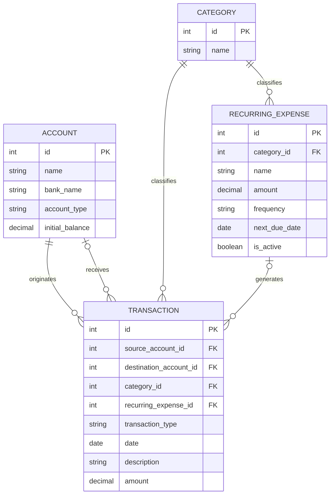

# Finance Tracker App

A personal finances tracker app for multiple accounts with support for categorisation, recurring transactions, and simple forecasting. FASTAPI + React + PostgreSQL.

---------------------------------------
<!-- TODO: add gif of final dashboard here -->

## Project Status
**Project is currently in active developement**
<!-- TODO: add live demo link here after developement complete -->

## Why I built this
I am currently a student and sometimes lose track of my spending leading to questionable financial decisions. A simple tracker application which could help me see my incoming and outgoing transactions would be helpful to better plan spending and take meaningful steps toward better personal finances. 

## Feature List
#### Implemented Features:
<!-- TODO: add final feature set here -->
- 
- 
- 

#### Future Work
- Hierarchical categories for spending categorisation
- Split transactions
- RRule parser for tracking frequencies of transactions

## Tech Stack

|Backend | Frontend | Database | Testing | CI             | Deployment |
|--------|----------|----------|---------|----------------|------------|
|FastAPI | React    |PostgreSQL| Pytest  | Github Actions | Render     |

## Architectural overview

## Setup + Installation Instructions
<!-- TODO: add setup instructions once backend scaffold exists -->

## Running Tests
<!-- TODO: add tests here -->

## Design Decisions
- I have decided to build iteratively. I will build the backend then test it and then move onto the frontend and then test that. This will mean that each layer can be tested on its own before they are integrated. 

- Because I transfer money between accounts a lot I have decided to make the transfers between accounts as having both a 'source_account_id' as well as a 'destination_account_id'

- To prevent scope creep for this project I have shelved some features that would be nice to have or that I have thought would be fitting for the project to the 'Future Work' section so that I can finish the project in around a month or so. 

## License 
[MIT License](LICENSE)